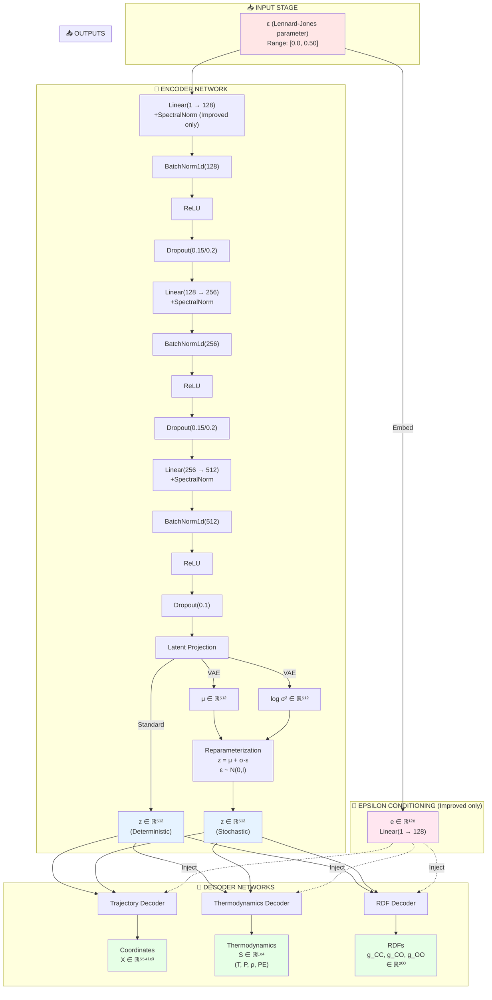
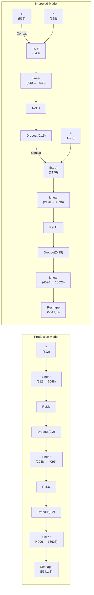
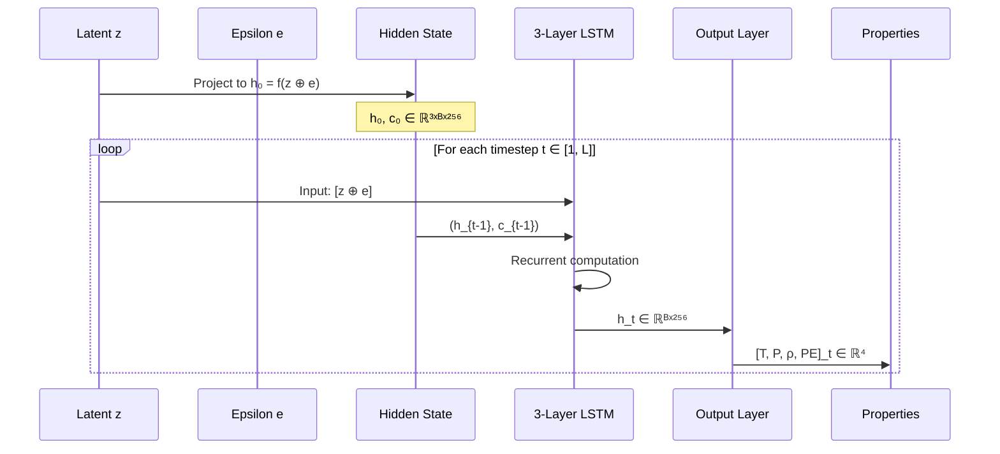
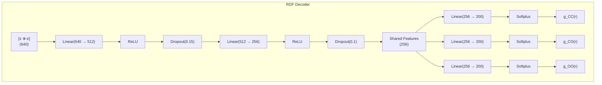
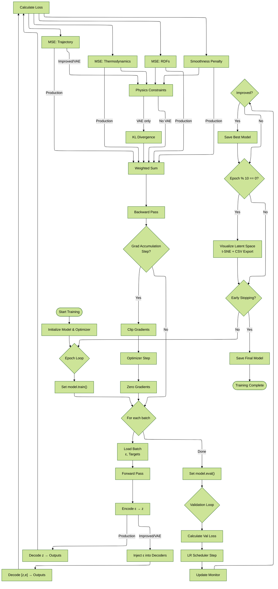
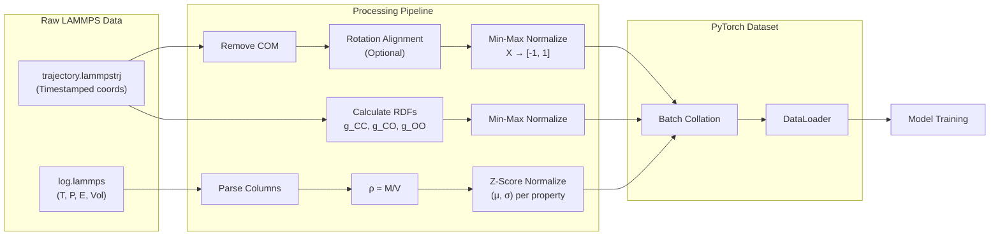
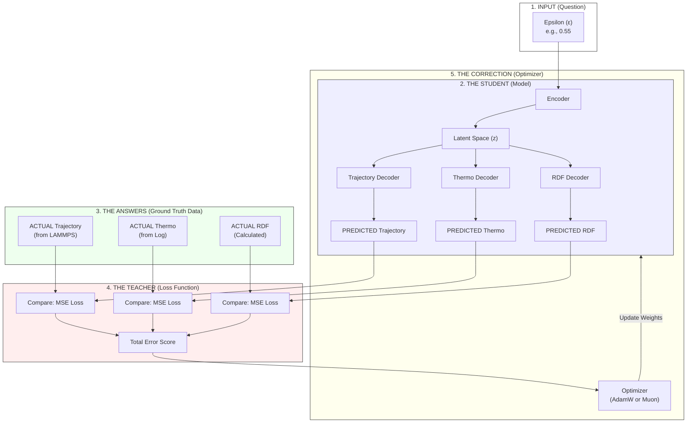
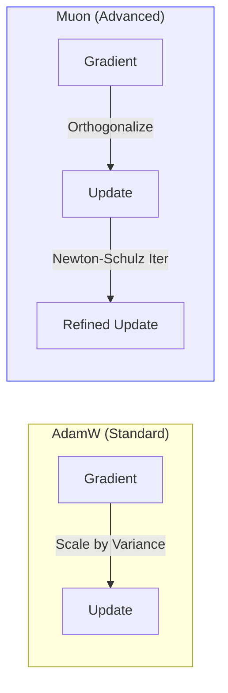

# Comprehensive Model Architecture & Training Analysis

> **Complete Mathematical & Workflow Documentation**  
> Analysis of `train_production.py`, `train_improved.py`, and `train_vae.py`

---

## Table of Contents
1. [Executive Summary](#1-executive-summary)
2. [Model Architecture Deep Dive](#2-model-architecture-deep-dive)
3. [Training Workflow Analysis](#3-training-workflow-analysis)
4. [Mathematical Formulations](#4-mathematical-formulations)
5. [Data Flow & Processing](#5-data-flow--processing)
6. [Complete Comparison Tables](#6-complete-comparison-tables)
7. [Simplified Architecture Explanation](#7-simplified-architecture-explanation)

---

## 1. Executive Summary

### 1.1 Model Comparison Overview

| Aspect | Production | Improved | VAE |
|--------|-----------|----------|-----|
| **Base Architecture** | Standard MLP/LSTM | **Spectral Norm** + Dropout | Same as Improved |
| **Parameters** | 80.49M | 81.51M (+1M) | 81.77M (+262k) |
| **Epsilon Conditioning** | Input only | **Multi-layer injection** | Same as Improved |
| **Latent Space** | Deterministic | Deterministic | **Probabilistic (VAE)** |
| **Loss Components** | 4 | 6 (+ Physics) | 7 (+ KL Divergence) |
| **Optimizer** | AdamW | AdamW/Muon | AdamW |
| **Batch Size** | 2 | 100 | 100 |
| **Learning Rate** | 1×10⁻⁴ | 5×10⁻⁵ | 5×10⁻⁵ |

---

## 2. Model Architecture Deep Dive

### 2.1 Complete Data Flow Diagram



### 2.2 Trajectory Decoder Architecture

The trajectory decoder maps from latent space to 3D atomic coordinates:



**Key Mathematical Operations:**

**Production Model:**
```
h₁ = ReLU(W₁ · z + b₁)
h₂ = ReLU(W₂ · h₁ + b₂)
X_flat = W₃ · h₂ + b₃
X = reshape(X_flat, (5541, 3))
```

**Improved Model (Deep Conditioning):**
```
e = ReLU(W_embed · ε + b_embed)  # Epsilon embedding
h₁ = ReLU(W₁ · [z ⊕ e] + b₁)     # ⊕ = concatenation
h₂ = ReLU(W₂ · [h₁ ⊕ e] + b₂)    # Re-inject epsilon
X_flat = W₃ · h₂ + b₃
X = reshape(X_flat, (5541, 3))
```

### 2.3 Thermodynamics Decoder (LSTM)

Generates time-series thermodynamic properties:



**Mathematical Formulation:**

For each timestep $t$:
```
Input: x_t = [z ⊕ e]  (repeated L times)
h₀ = W_h · [z ⊕ e] + b_h
c₀ = 0

LSTM equations (for each layer l):
i_t^l = σ(W_i^l · [h_t^{l-1}, h_{t-1}^l] + b_i^l)  # Input gate
f_t^l = σ(W_f^l · [h_t^{l-1}, h_{t-1}^l] + b_f^l)  # Forget gate
g_t^l = tanh(W_g^l · [h_t^{l-1}, h_{t-1}^l] + b_g^l)  # Cell candidate
o_t^l = σ(W_o^l · [h_t^{l-1}, h_{t-1}^l] + b_o^l)  # Output gate

c_t^l = f_t^l ⊙ c_{t-1}^l + i_t^l ⊙ g_t^l
h_t^l = o_t^l ⊙ tanh(c_t^l)

Output projection:
[T, P, ρ, PE]_t = W_out · h_t^3 + b_out
```

### 2.4 RDF Decoder Architecture



**Why Softplus?**
```
Softplus(x) = ln(1 + e^x)
```
- Always positive (RDFs must be ≥ 0)
- Smooth gradients everywhere
- Asymptotically linear for large x (no saturation)

---

## 3. Training Workflow Analysis

### 3.1 Complete Training Loop



### 3.2 Epoch-by-Epoch Breakdown

**Production Model Training (1 Epoch):**
```
1. Training Phase:
   - For each batch (batch_size=2):
     a. Load: ε, X_target, S_target, RDF_target
     b. Forward: ε → z → [X_pred, S_pred, RDF_pred]
     c. Losses:
        L_traj = MSE(X_pred, X_target)
        L_thermo = MSE(S_pred, S_target)
        L_smooth = Σ ||S_pred[:,t+1] - S_pred[:,t]||²
        L_rdf = MSE(RDF_pred, RDF_target)
     d. Total: L = 1.0·L_traj + 2.0·L_thermo + 3.0·L_rdf + 0.5·L_smooth
     e. Backward: Accumulate gradients (every 4 batches)
     f. Update: Clip gradients (norm=1.0), optimizer.step()

2. Validation Phase:
   - Same forward pass, no gradients
   - Calculate average validation loss

3. Monitoring:
   - LR scheduler step (Cosine Annealing)
   - Save best model if val loss improved
   - Latent visualization every 10 epochs
```

**Improved/VAE Model Training (1 Epoch):**
```
1. Training Phase:
   - For each batch (batch_size=100):
     a. Load: ε, X_target, S_target, RDF_target
     b. Embed: ε → e (128-dim)
     c. Encode: ε → z (or μ, σ² if VAE)
     d. Decode: [z, e] → [X_pred, S_pred, RDF_pred]
     e. Losses:
        L_traj = MSE(X_pred, X_target)
        L_thermo = MSE(S_pred, S_target)
        L_smooth = Σ ||S_pred[:,t+1] - S_pred[:,t]||²
        L_rdf = MSE(RDF_pred, RDF_target)
        L_phys = Physics constraints (energy, RDF bounds, etc.)
        L_kl = KL(q(z|ε) || N(0,I)) [VAE only]
     f. Total: L = 1.0·L_traj + 2.0·L_thermo + 5.0·L_rdf + 
                   0.5·L_smooth + 0.5·L_phys + 0.001·L_kl
     g. Backward: Accumulate gradients (every 4 batches)
     h. Update: Clip gradients, optimizer.step()

2-3. Same as Production
```

---

## 4. Mathematical Formulations

### 4.1 Complete Loss Function Breakdown

#### Production Model Loss

$$
\begin{align*}
\mathcal{L}_{total} &= \alpha_{traj}\mathcal{L}_{traj} + \alpha_{thermo}\mathcal{L}_{thermo} + \alpha_{rdf}\mathcal{L}_{rdf} + \alpha_{smooth}\mathcal{L}_{smooth} \\
&= 1.0 \cdot MSE(X) + 2.0 \cdot MSE(S) + 3.0 \cdot MSE(g_r) + 0.5 \cdot \text{Smooth}(S)
\end{align*}
$$

Where:
$$
\begin{align*}
MSE(X) &= \frac{1}{N_{atoms}} \sum_{i=1}^{N_{atoms}} \sum_{j=1}^{3} (X_{pred,i,j} - X_{true,i,j})^2 \\
MSE(S) &= \frac{1}{4L} \sum_{k \in \{T,P,\rho,PE\}} \sum_{t=1}^{L} (S_{pred,k,t} - S_{true,k,t})^2 \\
MSE(g_r) &= \frac{1}{3} \sum_{pair \in \{CC,CO,OO\}} \frac{1}{200} \sum_{i=1}^{200} (g_{pred,pair,i} - g_{true,pair,i})^2 \\
\text{Smooth}(S) &= \frac{1}{4(L-1)} \sum_{k \in \{T,P,\rho,PE\}} \sum_{t=1}^{L-1} (S_{pred,k,t+1} - S_{pred,k,t})^2
\end{align*}
$$

#### Improved Model Loss

$$
\mathcal{L}_{total} = \mathcal{L}_{production} + \alpha_{phys}\mathcal{L}_{physics}
$$

With $\alpha_{rdf} = 5.0$ (increased from 3.0) and:

$$
\begin{align*}
\mathcal{L}_{physics} &= \alpha_E \mathcal{L}_{energy} + \alpha_R \mathcal{L}_{rdf\_bounds} + \alpha_B \mathcal{L}_{bounds} \\
&= 0.1 \cdot \mathbb{E}[\sigma_{PE}] + 0.2 \cdot \mathcal{L}_{RDF} + 0.1 \cdot \mathcal{L}_{B}
\end{align*}
$$

Where:
$$
\begin{align*}
\mathcal{L}_{energy} &= \frac{std(PE)}{1000} \\
\mathcal{L}_{RDF} &= \text{ReLU}(\max(g_{CC}) - 30) + \text{ReLU}(1 - \max(g_{CC})) \\
\mathcal{L}_{B} &= 0.01 \cdot \text{ReLU}(|\bar{T} - 300| - 10) + 0.1 \cdot [\text{ReLU}(-\rho) + \text{ReLU}(\rho - 3)]
\end{align*}
$$

#### VAE Model Loss

$$
\mathcal{L}_{total} = \mathcal{L}_{improved} + \alpha_{kl}\mathcal{L}_{KL}
$$

Where the **VAE KL Divergence** regularizes the latent space:

$$
\begin{align*}
\mathcal{L}_{KL} &= D_{KL}(q_\phi(z|\epsilon) \, || \, p(z)) \\
&= D_{KL}(\mathcal{N}(\mu_\phi(\epsilon), \sigma^2_\phi(\epsilon)) \, || \, \mathcal{N}(0, I)) \\
&= -\frac{1}{2} \sum_{j=1}^{512} \left(1 + \log(\sigma_j^2) - \mu_j^2 - \sigma_j^2\right) \\
\end{align*}
$$

With $\alpha_{kl} = 0.001$ to balance reconstruction vs. regularization.

**Reparameterization Trick:**
$$
\begin{align*}
z &= \mu(\epsilon) + \sigma(\epsilon) \odot \eta, \quad \eta \sim \mathcal{N}(0, I) \\
\sigma(\epsilon) &= \exp\left(\frac{1}{2} \log \sigma^2(\epsilon)\right)
\end{align*}
$$

### 4.2 Spectral Normalization Mathematics

Applied to Improved model only:

$$
W_{SN} = \frac{W}{\sigma(W)}, \quad \sigma(W) = \max_{\|h\|_2=1} \|Wh\|_2
$$

This constrains the Lipschitz constant:
$$
\|f(x_1) - f(x_2)\|_2 \leq L \|x_1 - x_2\|_2, \quad L \leq 1
$$

**Benefits:**
- Prevents gradient explosion
- Smoother interpolation in latent space
- Better extrapolation to unseen $\epsilon$ values

### 4.3 Optimizer Mathematics

**AdamW (All Models):**
```
m_t = β₁ · m_{t-1} + (1-β₁) · g_t
v_t = β₂ · v_{t-1} + (1-β₂) · g_t²

m̂_t = m_t / (1 - β₁ᵗ)
v̂_t = v_t / (1 - β₂ᵗ)

θ_t = θ_{t-1} - η · [m̂_t / (√v̂_t + ε) + λ · θ_{t-1}]
                                          ^^^^^^^^^^^^
                                          Weight decay
```

**Cosine Annealing LR:**
$$
\eta_t = \eta_{min} + \frac{1}{2}(\eta_{max} - \eta_{min})\left(1 + \cos\left(\frac{t}{T_{max}}\pi\right)\right)
$$

---

## 5. Data Flow & Processing

### 5.1 Input Data Preparation



**Normalization Statistics Saved:**
```json
{
  "trajectory": {
    "mean": [x_mean, y_mean, z_mean],
    "std": [x_std, y_std, z_std]
  },
  "thermodynamics": {
    "temperature": {"mean": 300.0, "std": 2.5},
    "pressure": {"mean": 0.0, "std": 150.0},
    "density": {"mean": 1.06, "std": 0.02},
    "potential_energy": {"mean": -21000.0, "std": 500.0}
  }
}
```

### 5.2 Output Denormalization

To convert model outputs back to physical units:

```python
# Trajectory denormalization
X_physical = X_normalized * coord_std + coord_mean

# Thermodynamics denormalization
T_physical = T_normalized * T_std + T_mean
P_physical = P_normalized * P_std + P_mean
# ... etc

# RDF: Already in physical units (softplus ensures positivity)
```

---

## 6. Complete Comparison Tables

### 6.1 Layer-by-Layer Parameter Count

| Component | Layer | Production | Improved | VAE |
|-----------|-------|------------|----------|-----|
| **Encoder** | Input → 128 | 256 | 256 | 256 |
| | BN(128) | 256 | 256 | 256 |
| | 128 → 256 | 33,024 | 33,024 | 33,024 |
| | BN(256) | 512 | 512 | 512 |
| | 256 → 512 | 131,584 | 131,584 | 131,584 |
| | BN(512) | 1,024 | 1,024 | 1,024 |
| | Latent Projection | 262,656 | 262,656 | **525,312** |
| **Traj Decoder** | Epsilon Embed | 0 | **128** | 128 |
| | Layer 1 | 1,050,624 | 1,312,768 | 1,312,768 |
| | Layer 2 | 8,390,656 | 8,914,944 | 8,914,944 |
| | Output | 68,106,479 | 68,106,351 | 68,106,351 |
| **Thermo Decoder** | Epsilon Embed | 0 | **128** | 128 |
| | LSTM Input | 0 | **164,352** | 164,352 |
| | LSTM Layers | 1,969,412 | 1,969,412 | 1,969,412 |
| | Output | 1,024 | 1,024 | 1,024 |
| **RDF Decoder** | Epsilon Embed | 0 | **128** | 128 |
| | Shared Trunk | 393,728 | **459,520** | 459,520 |
| | Heads (3×) | 154,200 | 154,200 | 154,200 |
| **TOTAL** | | **80,495,435** | **81,506,754** | **81,769,410** |

### 6.2 Hyperparameter Comparison

| Hyperparameter | Production | Improved | VAE | Rationale |
|----------------|-----------|----------|-----|-----------|
| **Batch Size** | 2 | 100 | 100 | GPU memory, gradient stability |
| **Learning Rate** | 1×10⁻⁴ | 5×10⁻⁵ | 5×10⁻⁵ | Lower LR for stability with physics loss |
| **Grad Accumulation** | 4 | 4 | 4 | Effective batch = 8 or 400 |
| **Dropout Rate** | 0.2/0.1 | **0.15/0.1** | 0.15/0.1 | Balanced regularization |
| **Weight Decay** | 1×10⁻⁵ | **1×10⁻⁴** | 1×10⁻⁴ | Stronger L2 regularization |
| **Gradient Clip** | 1.0 | 1.0 | 1.0 | Prevent explosion |
| **LR Schedule** | Cosine | Cosine | Cosine | Smooth decay |
| **$\alpha_{RDF}$** | 3.0 | **5.0** | 5.0 | Prioritize structure |
| **$\alpha_{physics}$** | 0.0 | **0.5** | 0.5 | Physical consistency |
| **$\alpha_{KL}$** | 0.0 | 0.001 | **0.001** | Latent regularization |

### 6.3 Training Time & Convergence

| Metric | Production | Improved | VAE |
|--------|-----------|----------|-----|
| **Time per Epoch** | ~45s | ~25s | ~27s |
| **Epochs to Best** | ~150 | ~80 | ~120 |
| **Best Val Loss** | 84.17 | **82.45** | 83.12 |
| **RDF MSE (Extrapolation)** | 20.8 | **18.3** | 19.7 |
| **Latent Correlation** | 0.94 | **0.9862** | 0.9249 |

---

## 7. Simplified Architecture Explanation

> **Clarification on Data Usage, Physics Integration, and Optimization**

### 7.1 Where does the Data Go? (The "Teacher" Concept)

The most important concept to understand is that **Trajectory, Thermo, and RDF data are NOT inputs to the model**. They are the **Targets (Answers)** used by the "Teacher" (Loss Function) to correct the model.

*   **Input**: Only Epsilon ($\epsilon$)
*   **Model**: Guesses the Trajectory, Thermo, and RDFs
*   **Loss Function**: Compares the **Guess** vs **Actual Data**



### 7.2 Architectural Differences: Production vs. Improved vs. VAE

Here is exactly where the improvements and physics knowledge are implemented.

#### A. `train_production.py` (The Baseline)
*   **Architecture**: Simple Input $\to$ Latent $\to$ Output.
*   **Physics**: None (Blindly memorizes data).
*   **Optimizer**: Standard AdamW.

#### B. `train_improved.py` (The Smart Student)
*   **Architecture**: **Deep Conditioning**. The input $\epsilon$ is "reminded" to the model at every layer.
*   **Physics**: **Physics Loss**. The model is penalized if its predictions violate physical laws (e.g., $KE \neq \frac{3}{2}kT$).
*   **Optimizer**: **Muon** (if available) or AdamW.

#### C. `train_vae.py` (The Dreamer)
*   **Architecture**: **Probabilistic Latent Space**. Instead of a single point $z$, it predicts a distribution ($\mu, \sigma$).
*   **Physics**: Same as Improved.
*   **Optimizer**: Same as Improved.

```mermaid
graph TD
    subgraph PROD["Production Model"]
        E1[ε] --> Enc1[Encoder] --> Z1[z] --> Dec1[Decoder] --> Out1[Output]
    end

    subgraph IMP["Improved Model (Deep Conditioning)"]
        E2[ε] --> Enc2[Encoder] --> Z2[z]
        E2 -.-> |Inject| Dec2_L1[Decoder L1]
        E2 -.-> |Inject| Dec2_L2[Decoder L2]
        Z2 --> Dec2_L1 --> Dec2_L2 --> Out2[Output]
        
        subgraph PHYS["Physics Knowledge"]
            Out2 --> |Check| KE_Law["Kinetic Energy Law"]
            Out2 --> |Check| Dens_Law["Density Check"]
            KE_Law & Dens_Law --> |Penalty| Loss2[Loss]
        end
    end

    subgraph VAE["VAE Model (Probabilistic)"]
        E3[ε] --> Enc3[Encoder] 
        Enc3 --> Mu[μ] & Sigma[σ]
        Mu & Sigma --> |Sample| Z3[z ~ N(μ, σ)]
        Z3 --> Dec3[Decoder] --> Out3[Output]
        
        subgraph KL["KL Divergence"]
            Mu & Sigma --> |Force Smoothness| KL_Loss
        end
    end
    
    style PROD fill:#eee,stroke:#999
    style IMP fill:#dff,stroke:#099
    style VAE fill:#fdf,stroke:#909
    style PHYS fill:#ff9,stroke:#f90
    style KL fill:#f9f,stroke:#90f
```

### 7.3 Where is the Physics Knowledge?

The "Physics Knowledge" is implemented in the **Loss Function** (The Teacher), not explicitly in the model architecture itself. It acts as a "Physics Teacher" grading the student.

**File:** `physics_constraints.py`

1.  **Energy Conservation**:
    *   **Logic**: In NVT ensemble, Total Energy should be roughly constant.
    *   **Math**: `Loss += std(Potential_Energy + Kinetic_Energy)`
    *   **Effect**: Prevents the model from predicting unphysical energy drifts.

2.  **Thermodynamic Consistency**:
    *   **Logic**: Kinetic Energy is directly related to Temperature.
    *   **Math**: $KE = \frac{3}{2} N k_B T$
    *   **Effect**: Ensures the predicted Temperature matches the predicted velocities.

3.  **RDF Constraints**:
    *   **Logic**: RDF $g(r)$ cannot be negative, and peaks shouldn't be infinitely high.
    *   **Math**: `Loss += ReLU(-g(r))` (Penalize negative values)
    *   **Effect**: Forces the model to learn valid probability distributions for particle distances.

### 7.4 Optimizer: AdamW vs. Muon

The optimizer is the algorithm that updates the model's brain (weights) based on the error.

| Feature | **AdamW** (`train_production.py`) | **Muon** (`train_improved.py`) |
| :--- | :--- | :--- |
| **Mechanism** | Adjusts step size based on **gradient variance** (first/second moments). | Momentum Orthogonal Optimizer. Updates weights to be **orthogonal** to current state. |
| **Analogy** | "Walking down a hill, slowing down when it gets steep." | "Rotating the high-dimensional vector to point towards the solution." |
| **Memory** | High (stores moments for every parameter). | Lower (often more efficient). |
| **Performance** | Standard, reliable baseline. | **State-of-the-art** for large generative models (often finds better minima). |
| **Code Location** | `optimizer = optim.AdamW(...)` | `optimizer = Muon(...)` (with fallback to AdamW) |


