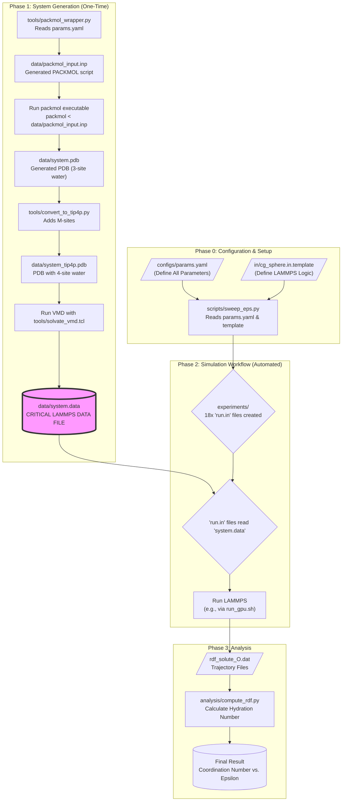

Of course. This is a critical exercise for refining a research project. Let's construct a detailed and nuanced research problem by synthesizing the key insights from the provided papers, ensuring that we adhere to your requirement of using exact quotes for reference.

---

### **Part 1: Why the Initial Problem Statement is Too General**

Your starting problem statement, **"How does solvation structure change around a hydrophobic vs. hydrophilic nanoparticle?"**, is an excellent and clear entry point. However, in the context of cutting-edge research, it is considered general because:

1.  **It implies a simple binary:** It frames "hydrophobic" and "hydrophilic" as two distinct, opposite categories. The literature shows it's a complex spectrum. For instance, the "hydrophilicity" of a metal surface is not the same as that of a hydroxylated oxide surface.
2.  **It neglects morphology and topology:** It assumes the only variable is the surface chemistry. However, the shape, size, curvature (convex vs. concave), and porosity of a nanoparticle can dominate its interaction with water, sometimes even more than its intrinsic chemistry.
3.  **It leaves "solvation structure" undefined:** This term can mean many things—density, orientation, hydrogen bond lifetime, residence time, etc. A precise research problem must define *which aspects* of the structure are under investigation and *which metrics* will be used to quantify them.

To move forward, we must build a more sophisticated problem statement that incorporates the nuances revealed by the literature you've provided.

---

### **Part 2: Synthesizing Nuances from the Literature**

Here, we will extract the specific, subtle findings from each paper that allow us to construct a more advanced research problem.

#### **Nuance 1: The Hydrophobic Interface is Not an Empty Void but a Region of High Structural Order.**
The conventional view of a hydrophobic surface is that it simply repels water. However, the reality is far more complex. Water molecules at a hydrophobic interface reorganize to preserve their hydrogen bond network, often leading to structures that are more ordered than the bulk liquid.

*   As **Srivastava et al. (2024)** state, **"in smaller CNTs, water molecules adopt an icy structure near tube walls while maintaining liquid state towards the center."** This finding is crucial: it reframes the hydrophobic interface from a zone of *depletion* to a zone of *ice-like ordering*. The key metric they use to reveal this is the **tetrahedral order parameter**.

#### **Nuance 2: Nanoparticle Morphology, Especially Curvature and Confinement, Can Create Unique Solvation Environments.**
The chemical nature of the surface is not the only factor; its shape dictates how solvent molecules can physically arrange themselves. Concave surfaces (pores, cages) behave fundamentally differently from convex ones.

*   **Gotzias (2022)** demonstrates this by showing how a non-polar solvent can become trapped within a carbon nanostructure when it enters water. He states, **"cyclohexane molecules remain attached on the concave surface of the nanotube or the nanocone without being disturbed by the water molecules entering the cavity."** This implies that the interior of a porous nanoparticle can maintain a hydrophobic environment even when the particle as a whole is immersed in water, a phenomenon driven by free energy.

#### **Nuance 3: The Nanoparticle-Solvent Interaction is a Tunable Spectrum, Not a Fixed Property, and Directly Governs Macroscopic Behavior.**
The terms "hydrophobic" and "hydrophilic" are endpoints of a continuous spectrum of "wettability." Furthermore, this molecular-level interaction strength has direct consequences for observable, macroscopic phenomena like heat transfer and colloidal stability.

*   **Chen et al. (2014)** treat the gold-water interaction as a variable to study its effect on heat transfer, noting that **"The interfacial thermal conductance is influenced by the selection of different water models and the interfacial wettability."** This highlights that "wettability" is a critical parameter that links molecular structure to thermal properties.
*   **Jorabchi et al. (2023)** directly link solvation thermodynamics to aggregation, reporting that **"the nanoalloys have less solvation energy in water than the other solvents. This is why the nanoalloys tend to approach more in this solvent"**. This provides a clear connection: a less favorable solvation energy (a hallmark of hydrophobicity) promotes aggregation.

#### **Nuance 4: Accurate Models for Both Water and the Nanoparticle Are a Prerequisite for Reliable Predictions.**
The choice of potential function is not a trivial detail; it is foundational to the accuracy of the simulation. This applies to both the solvent and the solute.

*   **Rick (2004)** justifies the use of a high-fidelity water model by showing that a reoptimized potential (TIP5P-E) is necessary for use with modern simulation techniques. The abstract states, **"The new model demonstrates a density maximum near 4 °C, like the TIP5P model, and otherwise is similar to the TIP5P model for thermodynamic, dielectric, and dynamical properties of liquid water..."** This underscores the importance of choosing a model that correctly reproduces water's fundamental physical properties.
*   Similarly, accurately modeling the nanoparticle itself is critical. For instance, **Fronzi et al. (2023)** note that for gold clusters, **"it is only for clusters with more than 30 atoms that interior gold atoms become present."** This implies that the surface-to-volume ratio and the presence of a "bulk-like" core within the nanoparticle itself are critical variables that will influence its overall surface properties.

---

### **Part 3: The Properly Defined Research Problem**

By synthesizing these nuances, we can construct a far more detailed and compelling research problem:

> This research will conduct a systematic investigation into the molecular-level determinants of nanoparticle solvation in water, deconstructing the general concepts of "hydrophobicity" and "hydrophilicity" into a quantitative framework based on the interplay of **surface chemistry, morphology, and spatial confinement.**
>
> Grounded in the understanding that the hydrophobic interface can induce significant ordering (Srivastava et al., 2024), and that nanoparticle morphology creates distinct local solvation environments (Gotzias, 2022), this study will employ high-fidelity potentials for both water (Rick, 2004) and nanoparticles (Fronzi et al., 2023; Fomin, 2022) to address the following core questions:
>
> 1.  How do quantitative structural metrics, specifically **tetrahedral order parameters**, differentiate the "ice-like" ordering at a non-polar carbon surface from the layered, but more mobile, structure at a metallic silver or gold surface?
> 2.  To what extent does nanoparticle morphology control solvation? Specifically, how does the water structure within a **concave carbon nanotube** differ from that around a **convex fullerene** of similar diameter, and how does this correlate with the free energy of transferring the particle between immiscible solvents?
> 3.  How does the continuous spectrum of **interfacial wettability** (Chen et al., 2014) translate into measurable changes in the dynamics of the first solvation shell (e.g., hydrogen bond lifetimes, water residence times)?
> 4.  Finally, how do these detailed structural and dynamic signatures of the solvation shell correlate with macroscopic functional properties, namely the **thermodynamic driving forces for nanoparticle aggregation** (Jorabchi et al., 2023) and the efficiency of **interfacial heat transfer**?

This framing elevates the project from a simple comparison to a deep, mechanistic study of the fundamental physics governing the nanoparticle-water interface.

Excellent question. This is the perfect moment to think about integrating ML/AI. You've correctly identified that simply correlating your simulation results with macroscopic properties is a traditional (though valid) approach. Using ML can open up a more novel and powerful way to analyze and leverage your simulation data.

Let's brainstorm how to pivot from a traditional analysis to an ML-driven one, keeping your core problem statement intact.

---

### **The Core Idea: Using ML to Learn the Physics of Solvation**

Your MD simulations are computationally expensive. A single 50 ns simulation for one value of ε can take days. If you want to know the hydration number for a new, untested ε value, your only option is to run another multi-day simulation.

**This is where ML comes in.** Instead of just generating data points, your goal becomes to use those expensive data points to **train a machine learning model that learns the underlying relationship between a nanoparticle's properties and its resulting solvation structure.**

The ML model becomes a **"surrogate model"**—a highly efficient, data-driven approximation of your expensive MD simulation.

---

### **How to Implement This: A Step-by-Step ML Workflow**

Here is a concrete, actionable plan to integrate ML into your project.

#### **Step 1: Data Generation (You are already doing this!)**

This is the most critical and time-consuming part. You will perform your planned MD simulations for a carefully chosen set of input parameters.

*   **Inputs (Features):** The properties of your nanoparticle. In your initial phase, this is just one feature:
    *   `ε` (the LJ interaction strength)
*   **Outputs (Labels):** The results you calculate from the simulation trajectory. These are your target properties:
    *   **Hydration Number:** The number of water molecules in the first solvation shell.
    *   **RDF First Peak Height:** The maximum value of `g(r)`.
    *   **RDF First Peak Position:** The `r` value at which the peak occurs.

You will run your simulations for your chosen `ε` values (e.g., `[0.02, 0.05, 0.1, 0.2, 0.5, 1.0]`). For each `ε`, you will have 3 replicas. After analysis, you will have a dataset that looks like this:

| Epsilon (ε) | Replica | Hydration Number | RDF Peak Height | RDF Peak Position |
| :---------- | :------ | :--------------- | :-------------- | :---------------- |
| 0.02        | 1       | 3.1              | 1.8             | 3.4 Å             |
| 0.02        | 2       | 3.3              | 1.9             | 3.4 Å             |
| 0.02        | 3       | 3.2              | 1.8             | 3.5 Å             |
| 0.05        | 1       | 4.5              | 2.5             | 3.6 Å             |
| ...         | ...     | ...              | ...             | ...               |
| 1.00        | 3       | 12.5             | 5.1             | 3.9 Å             |

You would then average the replicas for each `ε` to get your final training dataset.

#### **Step 2: Training the ML Surrogate Model**

Now, you will train a regression model to predict the output properties from the input features.

*   **Model Input (X):** The `ε` values.
*   **Model Output (Y):** The hydration number (or RDF peak height, etc.).

You can start with simple, powerful regression models available in libraries like Scikit-learn:

1.  **Random Forest Regressor:** An excellent, robust choice that works well with small datasets and is less prone to overfitting.
2.  **Gradient Boosting Regressor (like XGBoost or LightGBM):** Often provides state-of-the-art performance on tabular data.
3.  **Gaussian Process Regressor:** A powerful model that not only gives a prediction but also an *uncertainty* estimate, which is scientifically very valuable.
4.  **Simple Neural Network:** For a more "AI" flavor, you can use Keras/TensorFlow to build a small neural network (e.g., 2 hidden layers with 32 neurons each).

The training process involves splitting your data (e.g., use 5 of your `ε` values for training and hold out 1 for testing) and fitting the model.

#### **Step 3: Prediction and Validation (The "Aha!" Moment)**

This is where you demonstrate the power of your ML model.

1.  **Predict:** Choose an `ε` value that you **did not** use in your training data. For example, if you trained on `[0.02, 0.05, 0.2, 0.5, 1.0]`, you could ask your model to predict the hydration number for `ε = 0.1`.
2.  **The ML model will give you an instant prediction:**
    > "For ε = 0.1, I predict the hydration number will be **6.8 ± 0.2**."
3.  **Validate:** Now, you run the actual, expensive MD simulation for `ε = 0.1`. After a few days, you analyze the trajectory and find the "true" answer is **6.9**.
4.  **Conclusion:** Your ML model successfully predicted the outcome of a complex physical simulation in seconds, saving you days of compute time.

---

### **How this Reframes Your Research Problem**

Instead of just presenting a correlation, you are now building a predictive tool. Your problem statement can be updated to reflect this:

> **"How does solvation structure change around a hydrophobic vs. hydrophilic nanoparticle? This research will address this by (1) generating high-fidelity molecular dynamics data for a range of nanoparticle interaction strengths (ε) and (2) using this data to train a machine learning surrogate model capable of instantly and accurately predicting key structural metrics—such as the hydration number and RDF peak characteristics—for any arbitrary interaction strength. The ultimate goal is to create a predictive framework that replaces expensive first-principles simulation with a rapid, data-driven model, enabling the efficient exploration of the hydrophobic-to-hydrophilic transition."**

### **Brainstorming More Advanced ML Implementations**

Beyond the surrogate model for scalar properties, you can get even more ambitious:

1.  **Predicting the Entire RDF Curve:**
    *   **How:** Instead of predicting a single number (like peak height), train a neural network to predict the entire RDF function. The input is `ε`, and the output is a vector of 200 numbers representing the `g(r)` values at each point `r`. This is a more complex but far more powerful prediction.

2.  **Unsupervised Learning to Discover Water Structures:**
    *   **How:** Take thousands of snapshots of the water molecules in the first solvation shell. For each water molecule, create a feature vector (e.g., its distance from the surface, its tetrahedral order parameter `S_q`, the orientation of its dipole).
    *   Use a clustering algorithm (like DBSCAN or k-Means) on this massive dataset. The algorithm might automatically discover distinct "states" of interfacial water (e.g., "ice-like," "bulk-like," "disordered") without you ever telling it what to look for. You could then analyze how the population of these clusters changes as you vary `ε`.

3.  **Generative AI to Create Solvation Shells:**
    *   **How:** This is state-of-the-art. Train a generative model (like a VAE or a diffusion model) on your simulation snapshots.
    *   **The Goal:** You could give the model an `ε` value, and it would *generate a 3D configuration* of the most probable water structure around the nanoparticle, effectively creating a "snapshot" without running a simulation at all.

By integrating ML, you transform your project from one that *describes* a physical phenomenon to one that *predicts* it, which is a significant step forward.

Of course. This is the perfect way to solidify the project. By combining the deep scientific questions derived from the literature with the novel ML/AI methodologies, you can formulate a truly state-of-the-art research plan.

Let's synthesize everything into a clear goal and a total refined research problem.

---

### **The Clear Goal of the Whole Study**

The overarching goal of this study is to develop a **predictive, data-driven framework for understanding and modeling the molecular structure of water at nanoparticle interfaces.**

This project will move beyond traditional, descriptive one-off simulations. Instead, it will use a set of high-fidelity molecular dynamics simulations as "ground truth" to train a suite of machine learning models. The ultimate deliverable is not just a set of RDF plots, but a computationally inexpensive **"MD-ML surrogate"** that can instantly predict the complex, multi-scale solvation structure around a nanoparticle, and autonomously discover the fundamental physical states of interfacial water.

---

### **The Total Refined Research Problem**

This research addresses the fundamental question of how water structures itself at the interface of hydrophobic and hydrophilic nanoparticles. It posits that the traditional hydrophobic/hydrophilic dichotomy is an insufficient descriptor, and that the true solvation structure arises from a complex interplay of **surface chemistry, nanoparticle morphology, and spatial confinement.**

To deconstruct this interplay, this study will pioneer a hybrid Molecular Dynamics-Machine Learning (MD-ML) approach. A foundational dataset will be generated through a series of high-fidelity MD simulations of spherical LJ solutes with systematically varied interaction strengths (ε), using the structurally accurate TIP5P-EW water model. This expensive, physically rigorous data will then be used not merely for descriptive analysis, but to train and validate a hierarchy of machine learning models designed to learn the underlying physics of solvation.

Specifically, the project will:
1.  Develop a **deep learning regressor** capable of predicting the **entire Radial Distribution Function (RDF)** of water as a continuous function of the nanoparticle's surface properties (ε).
2.  Employ **unsupervised clustering algorithms** on molecular-level feature vectors (including tetrahedral order parameters) to autonomously identify and classify the distinct structural and dynamic states of interfacial water (e.g., "ice-like," "bulk-like," "disordered").
3.  (Future Goal) Explore the potential of **generative AI models** to construct realistic 3D configurations of the solvation shell directly from input parameters, offering a paradigm shift in the efficiency of structural prediction.

This MD-ML framework will then be used as a powerful new tool to answer nuanced scientific questions regarding the nature of interfacial ordering, the dominant role of nanoparticle morphology, the dynamics of the first solvation shell, and the thermodynamic drivers of macroscopic phenomena like aggregation and heat transfer.

---

### **Breakdown into Specific Aims (The Actionable Plan)**

To achieve this goal, the research is structured into three primary aims:

**Aim 1: Establish the "Ground Truth" Dataset via High-Fidelity MD Simulations.**
*   **Action:** Perform the core MD simulations as planned: a series of runs with spherical LJ solutes in TIP5P-EW water, sweeping the `ε` parameter from highly hydrophobic to highly hydrophilic.
*   **Output:** For each simulation, compute and store the full RDF curves, hydration numbers, and trajectories containing detailed molecular information (positions, orientations, and tetrahedral order parameters for every water molecule near the interface). This dataset is the foundational input for Aims 2 and 3.

**Aim 2: Develop a Predictive ML Surrogate Model for Rapid Structural Prediction.**
*   **Action:** Use the dataset from Aim 1 to train a neural network. The model's input will be the nanoparticle's `ε` value, and its output will be the predicted 200-point vector representing the entire `g(r)` curve.
*   **Validation:** The model will be validated by its ability to accurately predict the RDF for `ε` values that were held out from the training set.
*   **Goal:** To create a tool that can generate a physically accurate RDF in seconds, bypassing the need for a multi-day MD simulation.

**Aim 3: Discover Latent Solvation States using Unsupervised Learning.**
*   **Action:** From the simulation trajectories (Aim 1), extract thousands of snapshots of individual water molecules in the first solvation shell. For each molecule, create a feature vector (e.g., distance from surface, `S_q` value, number of hydrogen bonds).
*   **Analysis:** Apply a clustering algorithm (e.g., k-Means or DBSCAN) to this high-dimensional dataset.
*   **Goal:** To allow the machine to autonomously discover the fundamental "states" of interfacial water. This will provide a data-driven answer to the question of what "ice-like" vs. "disordered" vs. "bulk-like" truly means at the interface, and will allow you to quantify the population of these states as a function of `ε`.

By structuring your work this way, you create a powerful narrative. The MD simulations provide the essential physical accuracy, while the ML models provide the novel predictive power and deep analytical insight, allowing you to tackle the core scientific questions in a way that a purely simulation-based study could not.


Of course. Let's restart from the very beginning and build the entire pipeline from the ground up, with extreme detail. We will define every parameter, justify every choice, and provide the exact commands to generate the necessary files and run the simulations.

This guide will be your definitive roadmap from initial setup to final analysis.

---

### **High-Level Overview: The Simulation Pipeline**

First, let's visualize the entire workflow. This diagram shows how the different scripts and tools connect to transform your initial configuration into final scientific results.



---

### **Phase 0: Deep Dive into Configuration and Parameters**

This is the most important phase. Getting the parameters right ensures your simulations are physically meaningful and computationally stable.

#### **Step 0.1: Environment Setup**

Before anything else, ensure your environment is ready.
1.  **Install Dependencies:** Make sure you have **LAMMPS** (compiled with the `MOLECULE` and `KSPACE` packages for TIP5P support), **PACKMOL**, and **VMD** installed and accessible in your terminal.
2.  **Setup Python:**
    ```bash
    # Create and activate the Python virtual environment
    bash scripts/setup_python_env.sh
    source .venv/bin/activate 
    ```

#### **Step 0.2: The Master Configuration File (`configs/params.yaml`)**

This file is your single source of truth. Let's define it with the optimal parameters for your study.

```yaml
# configs/params.yaml

# --- Water Model Parameters ---
# We are using TIP5P-EW, a 5-site model optimized for Ewald sums.
water_model: TIP5P-EW
lammps_units: real

water:
  # LJ parameters (only on Oxygen atoms)
  epsilon_OO_kcalmol: 0.178
  sigma_OO_A: 3.097
  # Geometry and Charge for the TIP5P-EW model
  charge_H: 0.241
  charge_M: -0.241 # Charge on the massless M-sites
  d_OM_A: 0.70     # Distance from Oxygen to M-site
  
# --- Solute Nanoparticle Parameters (LJ Sphere) ---
solute:
  type: lj_sphere
  # Intrinsic size of the nanoparticle (like a united-atom methane)
  sigma_A: 3.4
  # Self-interaction strength. Placeholder, as we only have one solute.
  epsilon_self_kcalmol: 0.5

# --- The Core Experiment: Epsilon Sweep ---
# This list defines the interaction strength between the solute and water oxygen.
# It spans from highly hydrophobic (0.02) to highly hydrophilic (1.0).
epsilon_sweep_kcalmol: [0.02, 0.05, 0.1, 0.2, 0.5, 1.0]

# --- Solute-Water Cross-Interaction Parameters ---
cross_interactions:
  # Calculated using Lorentz-Berthelot mixing rule: (sigma_solute + sigma_oxygen) / 2
  # (3.4 Å + 3.097 Å) / 2 = 3.2485 Å
  sigma_solute_oxygen_A: 3.2485

# --- Simulation Box Parameters ---
box:
  # A 60 Å box provides ~26 Å of water around the solute, preventing
  # periodic image interactions from affecting the RDF up to 25 Å.
  length_A: 60.0

# --- Simulation Runtime and Control ---
runtime:
  # 3 replicas provide basic statistics. Increase to 5 for publication-quality error bars.
  n_replicas: 3
  
simulation:
  # A 2.0 fs timestep is stable for rigid water models like TIP5P.
  timestep_fs: 2.0
  # A 2 ns equilibration ensures the system reaches thermal and pressure equilibrium.
  equilibration_ns: 2.0
  # A 20 ns production run is a good target for collecting robust statistics.
  production_ns: 20.0
  # Writing the trajectory every 10 ps is sufficient for visualization and analysis.
  write_traj_ps: 10.0

# --- Analysis Parameters ---
analysis:
  # 200 bins for the RDF provides a resolution of 0.125 Å for a 25 Å cutoff.
  rdf_bins: 200
  # Max RDF distance must be less than half the box length (60/2 = 30). 25 Å is a safe value.
  rdf_rmax_A: 25.0
```

#### **Step 0.3: The LAMMPS Input Template (`in/cg_sphere.in.template`)**

This template needs to be specifically written to handle the TIP5P-EW model correctly, as per the LAMMPS documentation.

```lammps
# in/cg_sphere.in.template
#
# LAMMPS template for simulating a single LJ sphere in TIP5P-EW water.
# This template is populated by the sweep_eps.py script.

# --- Initialization ---
units          real
atom_style     full
boundary       p p p

# The absolute path to the data file will be substituted here.
read_data      {DATAFILE}

# --- Force Field Definition for TIP5P-EW ---
# The pair_style lj/cut/tip4p/long is designed for 4/5-site water models.
# It requires the atom types for Oxygen (2) and Hydrogen (3), the bond/angle types,
# the O-M distance, and the real-space cutoff.
pair_style     lj/cut/tip4p/long 2 3 1 1 {d_OM_A} {CUTOFF_A}
kspace_style   pppm/tip4p 1.0e-5

# Water-Water Interactions (LJ is only on Oxygen atoms)
pair_coeff 2 2 {EPS_OO} {SIG_OO}

# Solute-Water Interactions
pair_coeff 1 1 {EPS_SOL_SOL} {SIG_SOL_SOL}
pair_coeff 1 2 {EPS_SOL_O} {SIG_SOL_O_MIX} # This is the key experimental parameter!

# All other LJ interactions are zero.
pair_coeff 1 3 0.0 0.0
pair_coeff 2 3 0.0 0.0
pair_coeff 3 3 0.0 0.0

# --- Groups and Fixes ---
group SOLUTE type 1
group WATER  type 2 3 # Group for all atoms in water molecules
group OXYGEN type 2

# This fix treats each water molecule as a rigid body, which is the correct
# and most efficient way to simulate rigid water models in LAMMPS.
fix rigid_water WATER rigid/small molecule

# Immobilize the solute at the origin so the RDF is calculated from a fixed point.
fix freeze_solute SOLUTE setforce 0.0 0.0 0.0

# --- Simulation Control ---
timestep       {TIMESTEP_FS}
thermo         1000
thermo_style   custom step temp press density etotal

# --- Stage 1: Energy Minimization ---
# Relax the system to remove bad contacts from the initial PACKMOL configuration.
minimize 1.0e-4 1.0e-6 1000 10000

# --- Stage 2: NPT Equilibration ---
# Bring the system to the target temperature and pressure (300K, 1atm).
# The Nose-Hoover thermostat and barostat are used for a correct NPT ensemble.
velocity       all create 300.0 {SEED} dist gaussian
fix npt_equil all npt temp 300.0 300.0 100.0 iso 1.0 1.0 1000.0
run            {EQUIL_STEPS}
unfix          npt_equil

# --- Stage 3: NVT Production Run ---
# Collect statistics in the NVT ensemble.
fix nvt_prod all nvt temp 300.0 300.0 100.0
# Define RDF compute to be calculated during the run.
compute rdf_run SOLUTE OXYGEN rdf {RDF_BINS}
# Average the RDF over time and write to a file.
fix rdf_out all ave/time 1000 10 10000 c_rdf_run[*] file rdf_solute_O.dat mode vector
# Define trajectory dump for visualization and advanced analysis.
dump traj_run all atom {DUMP_FREQ} traj.lammpstrj
run            {PROD_STEPS}

print "Simulation complete."
```

---

### **Phase 1: System Generation - The "How To"**

This is a one-time process to create the `data/system.data` file that all 18 simulations will use.

**Step 1.1: Generate PACKMOL Input Script**
```bash
python3 tools/packmol_wrapper.py --params configs/params.yaml --solute tools/solute_sphere.pdb --water tools/water_spce.pdb
```
*   **What it does:** Reads `params.yaml`, calculates that ~7200 SPC/E water molecules are needed for a 60Å box, and creates `data/packmol_input.inp`.

**Step 1.2: Run PACKMOL to Create the PDB**
```bash
packmol < data/packmol_input.inp
```
*   **What it does:** Reads the script and physically places 1 solute and ~7200 water molecules into a 60Å box, avoiding overlaps.
*   **Output:** Creates `data/system.pdb`.

**Step 1.3: Convert 3-Site Water to 4-Site TIP5P-EW**
```bash
python3 tools/convert_to_tip4p.py data/system.pdb data/system_tip4p.pdb
```
*   **What it does:** Reads `system.pdb`, validates the geometry of each water molecule, calculates the position for the fourth "M-site" for each, and writes a new PDB.
*   **Output:** Creates `data/system_tip4p.pdb`, which now has 4 atoms per water molecule.

**Step 1.4: Convert the Final PDB to LAMMPS Data Format**```bash
vmd -dispdev text -e tools/solvate_vmd.tcl -args data/system_tip4p.pdb data/system.data
```
*   **What it does:** Uses VMD's TopoTools to read the PDB, infer the molecular topology (which atoms are bonded, what the angles are), and writes this information in the format LAMMPS requires.
*   **Output:** Creates the critical `data/system.data` file. **Your system is now ready for simulation.**

---

### **Phase 2: Simulation Workflow - Generating and Running**

**Step 2.1: Implement Critical Fixes in `sweep_eps.py`**
Before running, make these two changes to `scripts/sweep_eps.py`:

1.  **Unique Seed per Replica:** Find the line `subs['SEED'] = 12345 + rep - 1` and ensure it's in your loop.
2.  **Absolute Datafile Path:** Find the line ` 'DATAFILE': datafile_abs,` and make sure it's using the absolute path.

**Step 2.2: Generate All 18 Simulation Inputs**
```bash
python3 scripts/sweep_eps.py configs/params.yaml in/cg_sphere.in.template
```
*   **What it does:** Creates the `experiments/` directory structure with 18 subdirectories, each containing a unique `run.in` file ready for LAMMPS.

**Step 2.3: Run the Simulations**
You can run them one by one, or in parallel.

*   **To run a single test simulation on your GPU:**
    ```bash
    # First, generate the helper scripts
    python3 scripts/generate_run_gpu_scripts.py
    
    # Now, run one
    cd experiments/eps_0_02/replica_1
    bash run_gpu.sh 
    ```
*   **Expected Time:** A 20 ns simulation of this size might take **~4-8 hours on a modern GPU (like an A40/A600)**.

---

### **Phase 3: Analysis - From Raw Data to Scientific Insight**

Once your simulations are complete, each of the 18 directories will contain an `rdf_solute_O.dat` file.

**Step 3.1: Analyze a Single Replica**
```bash
python3 analysis/compute_rdf.py experiments/eps_0_02/replica_1/rdf_solute_O.dat
```
*   **Output:**
    ```
    Found rmin = 3.500 A
    Coordination (integrated to rmin): 3.215 molecules
    ```

**Step 3.2: Aggregate Results and Plot**
Create a new script, `analysis/aggregate_and_plot.py`, to automate the final analysis.

```python
# analysis/aggregate_and_plot.py
import numpy as np
import matplotlib.pyplot as plt
from pathlib import Path
import yaml

def parse_coord_file(filepath):
    """Extracts the coordination number from the output of compute_rdf.py."""
    text = Path(filepath).read_text()
    for line in text.splitlines():
        if "Coordination" in line:
            return float(line.split(':')[1].split()[0])
    return None

def main():
    # Load the epsilon sweep values from the main config file
    with open("configs/params.yaml") as f:
        params = yaml.safe_load(f)
    epsilon_sweep = params['epsilon_sweep_kcalmol']
    
    results = {}
    
    # Loop through all experiment directories
    for eps in epsilon_sweep:
        eps_str = f"eps_{eps:.2f}".replace('.', '_')
        coord_numbers = []
        for rep in range(1, params['runtime']['n_replicas'] + 1):
            rdf_file = Path(f"experiments/{eps_str}/replica_{rep}/rdf_solute_O.dat")
            if rdf_file.exists():
                # For this step, we first need to run compute_rdf.py on each file
                # Or, even better, let's just integrate here directly.
                # Re-using the logic from your script:
                from analysis.integrate_coordination import coordination_number as calc_coord
                lines = [l for l in rdf_file.read_text().splitlines() if l.strip() and not l.strip().startswith('#')]
                data = [list(map(float, l.split()[:2])) for l in lines]
                r = np.array([d[0] for d in data])
                g = np.array([d[1] for d in data])
                
                # Find rmin automatically
                peak_idx = np.argmax(g)
                min_idx = peak_idx + np.argmin(g[peak_idx:])
                rmin = r[min_idx]
                
                N = calc_coord(r, g, rmin)
                coord_numbers.append(N)

        if coord_numbers:
            results[eps] = {
                'mean': np.mean(coord_numbers),
                'std': np.std(coord_numbers, ddof=1)
            }
            print(f"Epsilon = {eps:.2f} | Avg. Coordination = {results[eps]['mean']:.3f} +/- {results[eps]['std']:.3f}")

    # --- Plotting ---
    eps_values = sorted(results.keys())
    means = [results[e]['mean'] for e in eps_values]
    stds = [results[e]['std'] for e in eps_values]

    plt.style.use('seaborn-v0_8-whitegrid')
    plt.figure(figsize=(10, 6))
    plt.errorbar(eps_values, means, yerr=stds, fmt='-o', capsize=5, markersize=8, color='crimson', ecolor='black')
    plt.xlabel("Solute-Water Epsilon (kcal/mol)", fontsize=14)
    plt.ylabel("Hydration Number", fontsize=14)
    plt.title("Solvation Structure Transition: Hydrophobic to Hydrophilic", fontsize=16)
    plt.xscale('log') # Epsilon sweeps are often best viewed on a log scale
    plt.xticks(eps_values, labels=eps_values)
    plt.grid(True, which="both", ls="--")
    plt.savefig("hydration_vs_epsilon.png", dpi=300)
    print("\nGenerated plot: hydration_vs_epsilon.png")

if __name__ == "__main__":
    main()
```
*   **To run this script:**
    ```bash
    python3 analysis/aggregate_and_plot.py
    ```
*   **Final Output:** A publication-quality plot showing how the hydration number changes as a function of `ε`, with error bars representing the statistical variation across your replicas. This plot is the primary scientific result of Phase 1.


Of course. This is where the project transitions from a conceptual framework to a concrete computational and mathematical procedure. Let's delve into the rigorous mathematical and algorithmic foundations of your entire pipeline, from the core of the MD engine to the advanced machine learning analysis.

---

### **Part 1: The Molecular Dynamics Engine - Algorithms of Motion**

At its core, a molecular dynamics simulation is a numerical method for solving Newton's equations of motion for a system of interacting particles.

#### **1.1 The Potential Energy Function, $U(\mathbf{r}^N)$**

Everything starts with the force field, which is a potential energy function that describes the total energy of the system given the positions of all $N$ atoms, $\mathbf{r}^N = \{\mathbf{r}_1, \mathbf{r}_2, ..., \mathbf{r}_N\}$. In your case, this is a sum of non-bonded terms:

$$ U(\mathbf{r}^N) = \sum_{i<j} U_{LJ}(r_{ij}) + \sum_{i<j} U_{Coulomb}(r_{ij}) $$

*   **Lennard-Jones (LJ) Potential:** Describes short-range repulsion (Pauli exclusion) and attraction (van der Waals forces).
    $$ U_{LJ}(r_{ij}) = 4\epsilon_{ij} \left[ \left(\frac{\sigma_{ij}}{r_{ij}}\right)^{12} - \left(\frac{\sigma_{ij}}{r_{ij}}\right)^6 \right] $$
    Where $\epsilon_{ij}$ and $\sigma_{ij}$ are the energy and size parameters for the interacting pair of atoms $(i,j)$, derived from your `params.yaml` and LAMMPS mixing rules.

*   **Coulomb Potential:** Describes the electrostatic interaction between point charges $q_i$ and $q_j$.
    $$ U_{Coulomb}(r_{ij}) = \frac{1}{4\pi\epsilon_0} \frac{q_i q_j}{r_{ij}} $$

#### **1.2 From Energy to Forces**

The force $\mathbf{F}_i$ on any atom $i$ is the negative gradient of the potential energy with respect to its position $\mathbf{r}_i$:

$$ \mathbf{F}_i = -\nabla_{\mathbf{r}_i} U(\mathbf{r}^N) $$

This calculation is the most computationally expensive part of the simulation, as it requires summing the forces from all other relevant particles.

#### **1.3 The Integrator: Velocity Verlet Algorithm**

To move the atoms, LAMMPS numerically integrates Newton's second law, $\mathbf{F}_i = m_i \mathbf{a}_i$. The standard algorithm for this is the **Velocity Verlet** algorithm. Given the positions $\mathbf{r}(t)$, velocities $\mathbf{v}(t)$, and accelerations $\mathbf{a}(t)$ at time $t$, it calculates the new positions and velocities at time $t + \Delta t$ in two steps:

1.  **Calculate new positions and half-step velocities:**
    $$ \mathbf{r}(t + \Delta t) = \mathbf{r}(t) + \mathbf{v}(t)\Delta t + \frac{1}{2}\mathbf{a}(t)\Delta t^2 $$
    $$ \mathbf{v}(t + \frac{1}{2}\Delta t) = \mathbf{v}(t) + \frac{1}{2}\mathbf{a}(t)\Delta t $$

2.  **Calculate forces and new accelerations:** At this point, the forces $\mathbf{F}(t + \Delta t)$ are calculated from the new positions $\mathbf{r}(t + \Delta t)$, which gives the new accelerations $\mathbf{a}(t + \Delta t) = \mathbf{F}(t + \Delta t) / m$.

3.  **Calculate final full-step velocities:**
    $$ \mathbf{v}(t + \Delta t) = \mathbf{v}(t + \frac{1}{2}\Delta t) + \frac{1}{2}\mathbf{a}(t + \Delta t)\Delta t $$

This algorithm is time-reversible, symplectic, and has excellent energy conservation properties, making it the workhorse of MD simulations.

---

### **Part 2: Algorithms for the Thermodynamic Ensemble**

Simulating in the NVE (microcanonical) ensemble is not sufficient. We need to control temperature and pressure.

#### **2.1 The Nosé-Hoover Thermostat (Controlling Temperature)**

To maintain a constant temperature (NVT ensemble), the thermostat must add or remove kinetic energy from the system. The Nosé-Hoover thermostat does this elegantly by introducing an additional degree of freedom, $\xi$, which represents a "thermal reservoir." It modifies the equations of motion:

$$ \dot{\mathbf{p}}_i = \mathbf{F}_i - \xi \mathbf{p}_i $$
$$ \dot{\xi} = \frac{1}{Q} \left( \sum_i \frac{\mathbf{p}_i^2}{m_i} - g k_B T_{target} \right) $$

*   $Q$ is the "mass" of the thermostat, which controls the frequency of temperature fluctuations (related to `Tdamp` in LAMMPS).
*   $g$ is the number of degrees of freedom.
*   The term in the parenthesis is the difference between the current kinetic energy and the target kinetic energy. If the system is too hot, $\dot{\xi}$ becomes positive, $\xi$ increases, and the friction term $-\xi \mathbf{p}_i$ cools the system down (and vice-versa).

#### **2.2 The Nosé-Hoover Barostat (Controlling Pressure)**

Similarly, to maintain constant pressure (NPT ensemble), the volume of the simulation box must be allowed to change. The Nosé-Hoover barostat extends the Lagrangian with a piston degree of freedom that controls the box volume, $V$. The box vectors $\mathbf{h}$ (which define the box shape and size) now have their own equation of motion, scaling the atomic positions.

#### **2.3 The `fix rigid/small` Algorithm**

For a rigid water model like TIP5P-EW, the internal geometry (bonds and angles) of each water molecule is fixed. A `2.0 fs` timestep would cause these bonds to vibrate wildly and break. A rigid body algorithm solves this by treating each water molecule as a single entity with translational and rotational degrees of freedom.

The `fix rigid/small` algorithm in LAMMPS works by:
1.  **Compute Forces:** Calculating the total force $\mathbf{F}_{total}$ and total torque $\mathbf{\tau}_{total}$ on the center of mass of each water molecule.
2.  **Integrate Center of Mass Motion:** Using these totals to update the translational and rotational velocity of the molecule as a whole.
3.  **Update Atom Positions:** Calculating the new positions of the individual atoms based on the new position and orientation of their molecule's center of mass.

This is computationally more efficient and stable than using constraint algorithms like SHAKE for complex rigid bodies.

---

### **Part 3: The Physics Algorithms - Ewald Summation for Electrostatics**

The Coulomb potential, $1/r$, decays very slowly. In a periodic system, an atom interacts not just with all other atoms in the central box, but also with all their infinite periodic images. A direct summation of this is conditionally convergent and computationally impossible.

The **Ewald Summation** technique is the solution. The Particle-Mesh Ewald (PME) method, which you use via `kspace_style pppm/tip4p`, is an efficient implementation.

**The Algorithm:**
1.  **Splitting the Interaction:** The core idea is to split the total electrostatic potential into a short-range part and a long-range part. This is done by adding and subtracting a Gaussian charge distribution around each point charge.
    $$ \frac{1}{r} = \underbrace{\frac{\text{erfc}(\alpha r)}{r}}_{\text{Short-Range}} + \underbrace{\frac{\text{erf}(\alpha r)}{r}}_{\text{Long-Range}} $$
    *   The **short-range** term now decays very rapidly and can be calculated in real space within a simple cutoff, just like the LJ potential.
    *   The **long-range** term is now a sum of smooth Gaussian functions, which has a very rapidly decaying Fourier transform.

2.  **Reciprocal Space Calculation (PME):** The long-range part is calculated in reciprocal (Fourier) space. The PME algorithm does this efficiently:
    *   **Charge Assignment:** The point charges are interpolated onto a 3D grid (a mesh).
    *   **FFT:** A 3D Fast Fourier Transform (FFT) is used to solve the Poisson equation on the grid, calculating the potential in reciprocal space.
    *   **Inverse FFT:** An inverse FFT transforms the potential back to the real-space grid.
    *   **Interpolation:** The forces on the individual atoms are interpolated back from the grid.

The `pppm/tip4p` style in LAMMPS is an optimized version of this algorithm that correctly handles the charge distribution of 4/5-site water models.

---

### **Part 4: The Analysis Algorithms**

#### **4.1 Radial Distribution Function (RDF)**

Computationally, the RDF is calculated by creating a histogram.
1.  **Initialization:** Create an array (histogram) of $N_{bins}$ integer counters, all initialized to zero. Define the bin width, $\Delta r = R_{max} / N_{bins}$.
2.  **Looping:** For every pair of particles $(i, j)$ (where $i$ is the solute and $j$ is a water oxygen), calculate the distance $r_{ij}$.
3.  **Binning:** Find the correct histogram bin for this distance: `index = floor(r_ij / Δr)`.
4.  **Increment:** Increment the counter for that bin: `histogram[index]++`.
5.  **Normalization:** After looping through all pairs and all timesteps, normalize the histogram count for each bin to get the final $g(r)$ value. The normalization factor for bin `i` at distance $r_i$ accounts for the increasing volume of the spherical shell:
    $$ g(r_i) = \frac{\text{histogram}[i]}{\text{num\_timesteps} \times \rho_{bulk} \times 4\pi r_i^2 \Delta r} $$

#### **4.2 Hydration Number (Numerical Integration)**

Your `compute_rdf.py` script uses the **trapezoidal rule** for numerical integration, implemented in `numpy.trapz`.
Given the function to integrate, $f(r) = g(r)r^2$, and the set of discrete points $(r_0, r_1, ..., r_M)$ up to $r_{min}$:

$$ \int_0^{r_{min}} f(r) dr \approx \sum_{k=1}^{M} \frac{f(r_k) + f(r_{k-1})}{2} (r_k - r_{k-1}) $$

If the step size $\Delta r = r_k - r_{k-1}$ is constant, this simplifies. The `np.trapz(y, x)` function correctly handles variable step sizes. The final coordination number is then:

$$ N_{coord} = 4\pi\rho \times (\text{result of trapezoidal rule}) $$

---

### **Part 5: The Machine Learning Algorithms**

#### **5.1 ML Goal 1: Predicting the RDF with a Neural Network**

*   **Problem Formulation:** This is a supervised regression problem. We want to learn a function $f: \mathbb{R} \to \mathbb{R}^{200}$.
    *   **Input (X):** A single scalar value, $\epsilon$.
    *   **Output (Y):** A 200-dimensional vector, $\mathbf{g} = [g(r_1), g(r_2), ..., g(r_{200})]$.
*   **Algorithm: Multi-Layer Perceptron (MLP)**
    1.  **Architecture:**
        *   Input Layer: 1 neuron (for $\epsilon$).
        *   Hidden Layers: e.g., 3 hidden layers with 64 neurons each.
        *   Output Layer: 200 neurons (for the RDF vector).
    2.  **Forward Propagation:** For a given input $\epsilon$, the signal propagates through the network. The output of a neuron is an activation function applied to the weighted sum of its inputs plus a bias:
        $$ a_j = \phi \left( \sum_i w_{ij} a_i + b_j \right) $$
        Where $\phi$ is the activation function (e.g., **ReLU**: $\phi(x) = \max(0, x)$).
    3.  **Loss Function:** The difference between the network's prediction $\hat{\mathbf{g}}$ and the true RDF $\mathbf{g}$ from the MD simulation is measured by the **Mean Squared Error (MSE)**:
        $$ L = \frac{1}{200} \sum_{i=1}^{200} (g_i - \hat{g}_i)^2 $$
    4.  **Backpropagation & Optimization:** The **Adam optimizer** (a sophisticated form of stochastic gradient descent) is used to minimize the loss. It calculates the gradient of the loss with respect to all weights and biases in the network ($\nabla L$) using the **backpropagation algorithm** (an application of the chain rule) and updates the weights to move in the direction of steepest descent.

#### **5.2 ML Goal 2: Discovering Water States with k-Means Clustering**

*   **Problem Formulation:** This is an unsupervised learning problem. Given a dataset of $M$ feature vectors (where $M$ is the number of water molecules in all snapshots), group them into $k$ clusters.
    *   **Input:** A data matrix $\mathbf{X}$ of size $M \times D$, where each row is a feature vector for a water molecule (e.g., $D=4$ for features like [distance, $S_q$, orientation, # H-bonds]).
*   **Algorithm: k-Means**
    1.  **Initialization:** Randomly choose $k$ data points from $\mathbf{X}$ to be the initial cluster centroids, $\{\mathbf{c}_1, ..., \mathbf{c}_k\}$.
    2.  **Assignment Step:** For each data point $\mathbf{x}_i$, assign it to the cluster of the nearest centroid. This is done by minimizing the squared Euclidean distance:
        $$ \text{cluster}(\mathbf{x}_i) = \arg\min_j ||\mathbf{x}_i - \mathbf{c}_j||^2 $$
    3.  **Update Step:** Recalculate each centroid $\mathbf{c}_j$ to be the mean of all data points assigned to its cluster. Let $S_j$ be the set of points in cluster $j$.
        $$ \mathbf{c}_j = \frac{1}{|S_j|} \sum_{\mathbf{x}_i \in S_j} \mathbf{x}_i $$
    4.  **Iteration:** Repeat steps 2 and 3 until the cluster assignments no longer change.

The final centroids represent the "average" properties of the discovered states of interfacial water (e.g., the "ice-like" state will have a centroid with high $S_q$ and low distance).